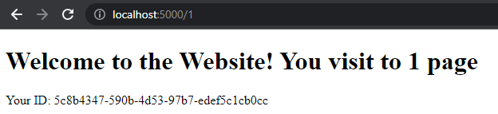
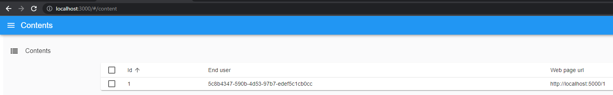

Test task

Solution consists of 3 components, which are connected with each other:
1. Simple website with several pages, theme/style is up to you. End-user gets its own id number,
which is stored in cookie. For each web page visiting, information of {end_user_id,
web_page_url} is sent to a server (second component).
2. Server gets the information from the first component and sent this information to the third
component.
3. Admin website, which gets the information from the Server {end_user_id, web_page_url} and
list this information grouped by end_user_id. It is up to you how to present the information.

Additional technical requirements.
More technical requirements are implemented – higher rate candidate gets.
1. Communication between second and third component is done via websocket.
2. Admin website is build using React Admin library (link is provided below in References).
3. Solution is put into the docker container/s. To test the solution, docker container/s should
produce 2/3 urls with different ports: url for Simple website, url for Admin website.

### Description
* http://localhost:5000/{page} - WebSite
    * page 1,2,3
* http://localhost:3000/#/content - Admin
* No view
  * http://0.0.0.0:3001 - JsonServer
  * http://localhost:5001 - Server

### How to install:
CMD command:
***
    docker-compouse up --build
***
### Usage:
Go to http://localhost:5000/1 we can view our ID on the site

After generating/retrieving from cookies, we sent a request to Server(http://localhost:5001) and it, in return, sent a request to JsonServer(http://localhost:3001)
and we can see the data in Admin-panel(http://localhost:3000/#/content).

### How to remove:
CMD command:
***
docker-compose down
***
